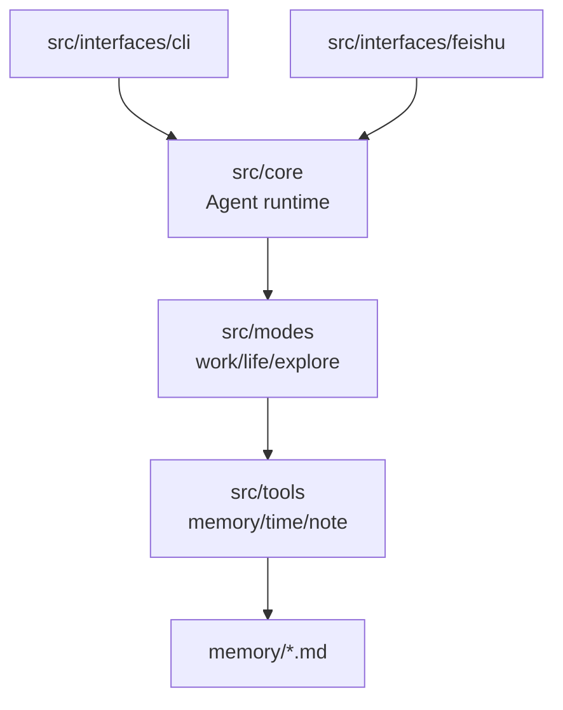

# Boxgent

Boxgent is a small personal agent inspired by Helixent's layering:

- core runtime: model, messages, tools, and ReAct-style loop
- modes: work, life, explore
- interfaces: terminal CLI and Feishu bot webhook
- memory: markdown files under `memory/`

## Setup

```bash
cp .env.example .env
bun install
```

Export env vars before running, or load them with your shell:

```bash
export MODEL_BASE_URL="https://api.openai.com/v1"
export MODEL_API_KEY="sk-..."
export MODEL_NAME="gpt-4o-mini"
```

## CLI

Interactive:

```bash
bun run cli
```

One-shot:

```bash
bun run src/index.ts cli work "帮我写一个项目周报提纲"
bun run src/index.ts cli life "规划一下周末采购"
bun run src/index.ts cli explore "我想研究具身智能，先给我知识地图"
```

Modes are session state. The agent will not auto-switch based on keywords.
Switch explicitly, and the selected mode stays active for later messages:

```text
/work
整理这个需求
/life
明天晚上提醒我买药
/explore 帮我拆解一个研究主题
```

You can use `/mode` in the CLI to show the current mode.

The CLI renders a large Boxgent header with the agent name, version, configured model,
and current working path. It also sets the terminal window title where supported and
shows compact run status while the agent is thinking, using tools, and preparing the
final answer.

## Feishu

Run the webhook server:

```bash
export FEISHU_PORT=3000
export FEISHU_APP_ID="cli_..."
export FEISHU_APP_SECRET="..."
export FEISHU_VERIFICATION_TOKEN="..."
bun run feishu
```

Configure Feishu event subscription to:

```text
http://your-public-host/feishu/events
```

For local development, expose the port with a tunnel such as ngrok/cloudflared.

The Feishu adapter currently handles:

- URL verification
- text message events
- replies through `im/v1/messages/:message_id/reply`
- proactive chat messages through `im/v1/messages?receive_id_type=chat_id`
- per-chat mode state with `/work`, `/life`, and `/explore`
- per-chat automation tasks stored in `data/feishu-schedules.json`

Automation commands:

```text
/schedule at 2026-05-10 21:30 总结今天的工作
/schedule every 30m 检查一下项目状态
/schedule daily 09:00 生成今日计划
/schedule list
/schedule cancel <任务ID>
```

Chinese aliases are also supported:

```text
/定时 at 2026-05-10 21:30 总结今天的工作
/定时 每天 09:00 生成今日计划
/定时 列表
/定时 取消 <任务ID>
```

Scheduled tasks run in the chat's current mode and send their result back to the
same Feishu chat. Times are parsed in the server's local timezone.

## Architecture


